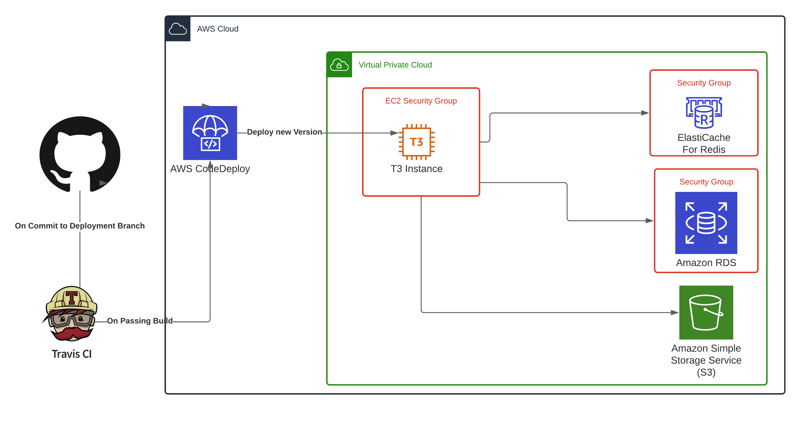

# Suffolk County District Attorney API

## Current Status 
The API is currently setup with a single form as an example of how the rest will look. Basics tests 
have been setup but are still being completed(code coverage is very low right now). 

The current test form, a criminal complaint form(called a ccf or cc in the code) features an upload route
to upload the document and get a tracking ID to follow the progress of the processing. Records can be 
retrieved from the `/records` endpoint -- along with URLs for uploaded images. All of these routes related to uploading, viewing and verifying documents are protected by special permission that must be explicitly granted by a superuser(even a superuser does not have access to these routes by default).

## Major Items that need updating

This is a hopefully exhaustive list of all the technical debts that have crept into this project and have not been fixed yet. 

- The prefix of uploaded S3 objects is statically set by the function call not a config file or environment variable. Ideally, a different prefix would be used for each form type etc. As of right now everything gets uploaded into `test/{obj_id}`
- Photo Link TTL is set statically in code
- frontend app is built(compiled) in a "dev" way not a production build. What I mean is that the frontend still has hot-reload and other development features enabled even for production environments. 
- Travis CI does not run backend or frontend tests before pushing to CodeDeploy
- The local development environment does not offer an abstraction of S3. By this I mean that there is no locally hosted(ie in a docker container) version of S3 that can be run without the need for an external resource. Using something such as `localstack` would be a good addition so this external requirement is not needed for local development. 


### API Documentation

The best way to learn about the API is to follow the `domain.name/api/docs` route and view the interactive
swagger documentation for the routes. 

### Frontend access

You can access the frontend, namely the admin dashboard that enables you to edit user permissions via
`domain.name/admin`. Superuser permissions are required to log into this dashboard.

### Account types

As mentioned in the current status section above, there are three types of users. A `user`, a `superuser` and 
`county_authorized`. Anyone can signup and become a `user` but this does not afford them access to any routes.
Meanwhile, a `superuser` has the authorization to edit details(including permissions) of all users. 
`county_authorized` users are the only accounts that have access to routes that interact with the backend
including viewing records, uploading new documents etc. 

In summary: 

- Anyone can signup and has access to only `/api/v1/users/me`
- `county_authorized` users can access `/records` and `/uploads` routes.
- `superuser` users can access `/users` routes which enable them to edit all other users.

## AWS Infrastructure

This project is currently being hosted in AWS to provide a live playground for testing and 
development. It has been configured with `dev` and `prod` environments that are connected via
automatic deployment to the `dev` and `master` Github branches respectively. 

The core of the API runs in an EC2 container, with the database and Redis server running 
in separate AWS service instances. A general diagram of the setup can be seen here. Note that it
it lacks some of the AWS 'fluff' required to interact with the service, such as internet gateway etc.


### CI/CD System

Travis CI runs on the `master` and `dev` branches and will push to CodeDeploy using the built in extension in Travis for performing this action. CodeDeploy then handles deploying the updated code to the correct EC2 instances based on the build flags(`dev`, `prod`) and how machines are tagged(`dev`, `prod`)

CodeDeploy is configured via the `appspec.yml` file located in the root of the project. This specifies the scripts run for each lifecycle event along with the location of deployed files etc(currently set as `\srv\scdao-api`)

> :warning: You will need to reconfigure this connection between Travis and CodeDeploy to whatever repository that will be utilized.

> :warning: You will need to provide Travis with the correct secrets to push to CodeDeploy. Check the docs [here](https://docs.travis-ci.com/user/deployment/codedeploy/)

### EC2 Instances Required Configs and Notes

The EC2 instances are fairly vanilla in their configuration and do not require much beyond their default state. They require the following:

- AWS System Manager(Installed by default in most AWS images, ie, Ubuntu and AWS AMI Linux)
- CodeDeploy Agent(Deployable via System Manager)
- Docker & Docker Compose
- SSH Access
- Port 80 and 443 open

> :warning: EC2 instances should really live behind a strict Security Group(ie a firewall in AWS) that limits their traffic. For example, only ports 80, 443, and 22 are require as open input ports and similar restrictions can be placed on egress ports. Although remember that ports are stateful in security groups, if a connection is opened outbound that same host can perform an incoming connection on that same port.

> :warning: EC2 instances should probably be configured with a basic firewall as well to ban repeated login attempts etc. Something such as fail2ban and ufw would make a good combination. 

### RDS and ElastiCache

RDS and ElastiCachce are being utilized as the managed database providers, RDS provides a Postgres database for storage of most data. ElastiCache is used as a task broker by Celery. Both live in the **private** VPC to protect them from external access. They also both have a security group that **tightly** controls access(only open on a specific port to the EC2 instance)

Both also feature at rest encryption. RDS also has in transit encryption enabled via TLS. 

### Docker Configs

There are four docker compose files that are utilized for various different environments. The commands for production and dev environments are below. You can find examples of their use in the `/scripts` folder.

Dev:
`docker-compose -f docker-compose.yml -f docker-compose.dev.yml up`
Prod: 
`docker-compose -f docker-compose.yml -f docker-compose.prod.yml up`

If you are just running things locally you do not need to specify what docker-compose file should be utilized. This is because docker will use the default `docker-compose.yml` and combine it with `docker-compose.override.yml` producing a config that works for running things locally. 

It's also important to create and accurately fill in the `.env` file that docker leverages to provide required environment variables to each container. There is a template provided and an example of a local config that should work but is not appropriate for anything where security would be a concern(So anything publicly accessible on the internet).

The one caveat is that you will need an S3 bucket setup even to run things locally. This is because the API will upload the image uploaded via the API to S3 -- if this fails the entire operation also fails. 

## Routes Overview

The HTTP routes(and the actions they perform) are all fairly self explanatory but I will expand on this a bit here just to clarify some aspects of the how the system is defined to 'flow'. 

### Upload routes
The upload routes enable the user to upload specific form types to the API for processing. They return a task ID that can be used to lookup the current status of the task(this for example would be useful to let the user know that processing failed for whatever reason, bad image etc.) 

The general flow of these is as follows:
- User uploads file via `HTTP POST`
- File is kept in memory while the following is performed 
    - Random UUID filename is generated
    - File saved to temporary path
    - filename + path returned to the calling function 
- Task is sent to celery
    - Image text is extracted
    - Content is verified
    - File uploaded to S3(As long as no errors occurred)
    - Object created in database
    - Task status is updated

### Record routes

The record routes are super basic CRUD routes that don't do anything special. They support basic paging and record retrieval but nothing terribly special.

### Photo Link Generation

As the original images are stored in S3 private bucket if you desire to present the image to the end user it required generating a special link. There is a route to perform this operation called `/ccf/img/{cc_id}'` that will generate a time limited link for viewing th file. It contains the require public key to view the file for a specified period of time.

> :warning: The link TTL is currently set statically in the code. It should be moved to an environment variable. 


## Development

The only dependencies for this project should be docker and docker-compose and the environment variable file.

In a development environment(locally or in AWS) hot reload is enabled for both the frontend 
and backend. This means you don't need to restart contrainers to see your changes. The CLI should print
status updates as the API reboots and applies your changes. 

This is **not** the case for code that is run on celery workers. You must reboot the celery worker
so restarts with the new code. This can be done with the following command:

`docker-compose restart worker`

> :warning: If you change code that is run on a celery worker you must restart the docker container! Otherwise 
your changes will not be applied.

### Environment Variable Settings

Environment variables are throughout the project for sensative or enviornment specific configuration details. They are loaded by docker from the .env file located in the 
root of the project directory. A template is provided that lists all the values you must fill out. In addition, there is a "local template"
provided called `.envLocalExample` that is meant to be a working version of the environment variable file ready for local development. 

You must set these values for things to compile and run. As mentioned in above sections S3 is still an external dependency so either be alright with
that part of the API not working or setup an S3 resource and configure it correctly for use by the API
### Variable Details
```
# This is the hash key used for hasing all passwords.
HASH_KEY=
# This is the S3 Key
S3_KEY_INTERNAL=
# S3 Secret
S3_SECRET_INTERNAL=
# S3 bucket
S3_BUCKET_NAME=
# Redis DB URL, full with port, url and database number
REDIS_DB_URL=
# Postgres DB url, must include: user, password, port and database name
POSTGRES_URL=
# Required by the postgres image. Should use the same password here as in POSTGRES_URL
POSTGRES_PASSWORD=
```

### Quick Start

Starting the project with hot-reloading enabled
(the first time it will take a while):

```bash
docker-compose up -d
```

This command automatically applied the `docker-compose.override.yml` file on top of the base `docker-compose.yml` file. The override file specifies various extra resources that enable local development without the need for hosted services.

To run the alembic migrations for any database updates:

```bash
docker-compose run --rm backend alembic upgrade head 
```

And navigate to http://localhost:80

_Note: If you see an Nginx error at first with a `502: Bad Gateway` page, you may have to wait for webpack to build the development server (the nginx container builds much more quickly)._

Auto-generated docs will be at
http://localhost:80/api/docs

### Rebuilding containers:

```
docker-compose build
```

### Restarting containers:

```
docker-compose restart
```

### Bringing containers down:

```
docker-compose down
```

### Frontend Development

Alternatively to running inside docker, it can sometimes be easier
to use npm directly for quicker reloading. To run using npm:

```
cd frontend
npm install
npm start
```

This should redirect you to http://localhost:3000

### Frontend Tests

```
cd frontend
npm install
npm test
```

## Migrations

Database migrations are run using alembic. To run all migrations:

```
docker-compose run --rm backend alembic upgrade head
```

To create a new migration:

```
alembic revision -m "create users table"
```

And fill in `upgrade` and `downgrade` methods. For more information see
[Alembic's official documentation](https://alembic.sqlalchemy.org/en/latest/tutorial.html#create-a-migration-script).

## Testing

There is a helper script for both frontend and backend tests:

```
./scripts/test.sh
```

### Backend Tests

```
docker-compose run backend pytest
```

any arguments to pytest can also be passed after this command

### Frontend Tests

```
docker-compose run frontend test
```

This is the same as running npm test from within the frontend directory

## Logging

```
docker-compose logs
```

Or for a specific service:

```
docker-compose logs -f name_of_service # frontend|backend|db
```

## Project Layout

```
backend
└── app
    ├── alembic
    │   └── versions # where migrations are located
    ├── api
    │   └── api_v1
    │       └── endpoints
    ├── core    # config
    ├── db      # db models
    ├── tests   # pytest
    └── main.py # entrypoint to backend

frontend
└── public
└── src
    ├── components
    │   └── Home.tsx
    ├── config
    │   └── index.tsx   # constants
    ├── __tests__
    │   └── test_home.tsx
    ├── index.tsx   # entrypoint
    └── App.tsx     # handles routing
```
